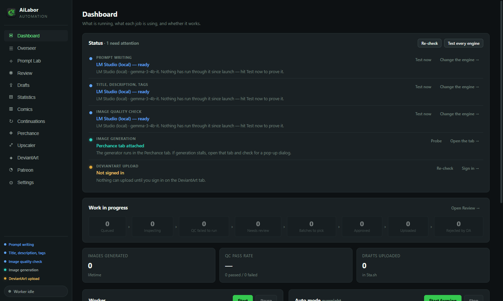
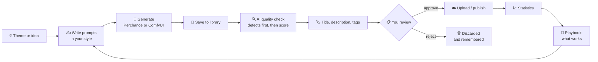
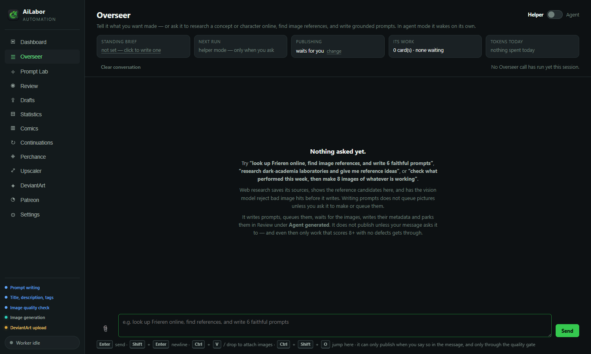
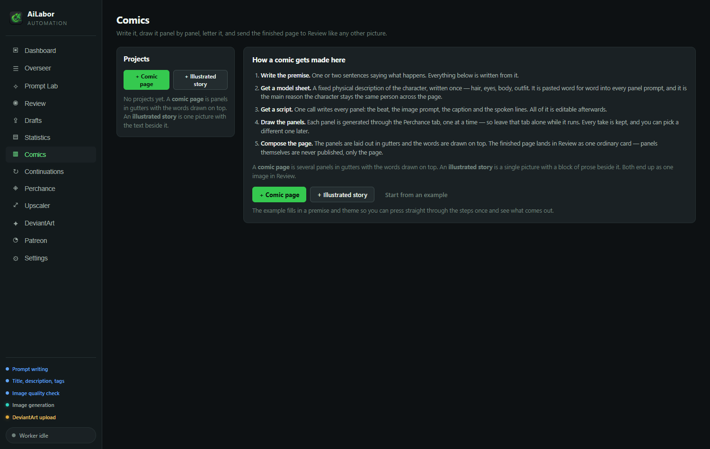
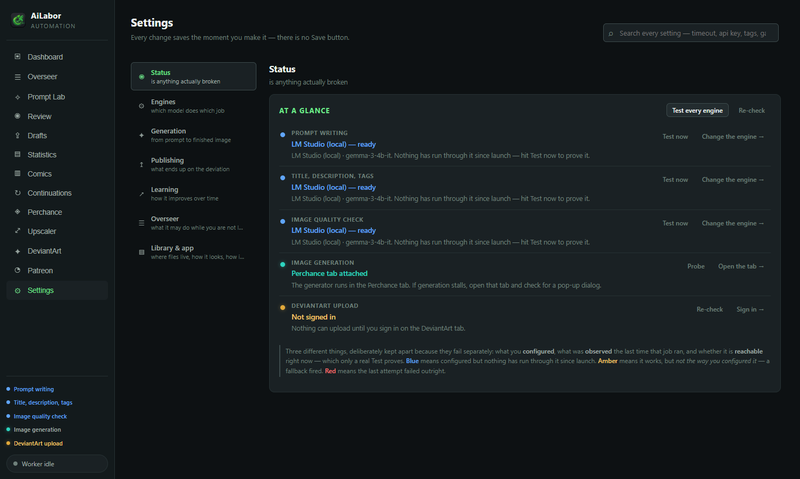
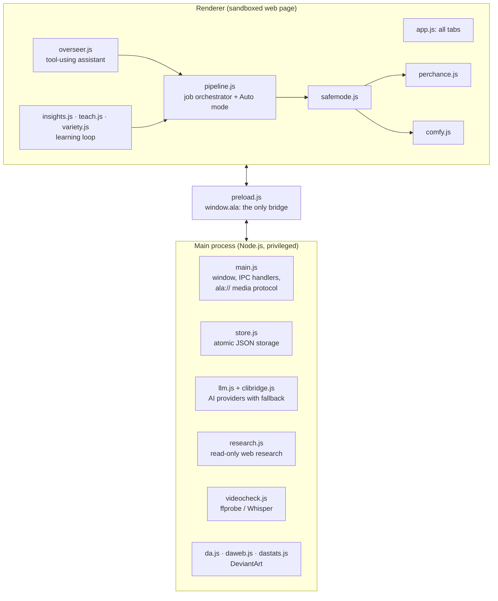

<div align="center">


# AiLabor Art Studio

**An AI art studio that runs on your own computer.**
You describe what you want to make. The app writes the prompts, generates the images,
checks every picture for mistakes, writes titles and descriptions, and lines everything
up for you to approve. Nothing goes out without you saying so.

[](LICENSE)




</div>

---

## Contents

- [What is it, in plain words?](#what-is-it-in-plain-words)
- [What it can do](#what-it-can-do)
- [The whole story: how a picture is made](#the-whole-story-how-a-picture-is-made)
- [Install and run](#install-and-run)
- [A tour of the app](#a-tour-of-the-app)
- [All-ages safe mode](#all-ages-safe-mode)
- [For code reviewers](#for-code-reviewers)
- [Project layout](#project-layout)
- [Testing](#testing)
- [FAQ and troubleshooting](#faq-and-troubleshooting)
- [License](#license)

---

## What is it, in plain words?

Making AI art sounds like one step ("type a sentence, get a picture"). In practice it's a
long chain of small, repetitive jobs. You write a good prompt, generate several versions,
and look closely at each one for broken hands or garbled text. Then you pick the best,
think of a title, write a description, choose tags, and upload it. After that you check how
it did and use that to decide what to make next.

**AiLabor Art Studio automates the boring parts of that chain and leaves the decisions to you.**

Think of it as a small studio team that lives inside one desktop app:

| Team member | What it does for you |
|---|---|
| ✍️ **Writer** | Turns a theme ("lighthouses in a storm") into several detailed image prompts, in *your* style |
| 🎨 **Illustrator** | Sends those prompts to an image generator, either the free Perchance website or ComfyUI on your own GPU |
| 🔍 **Quality inspector** | An AI that looks at every picture and scores it, listing defects like extra fingers, melted faces or broken text |
| 🏷️ **Editor** | Writes a fresh title, a description and search tags for each picture |
| 📋 **You, the art director** | See everything in one Review grid. Approve or reject with one key, edit any text |
| 📈 **Analyst** | Watches which published pieces people liked and feeds those lessons back to the Writer |
| 🤖 **Assistant (the Overseer)** | A chat you can talk to in plain English: *"research this character and make 6 pictures of it"* |

It works with **free, local AI** (e.g. [LM Studio](https://lmstudio.ai/) on your own PC)
and with paid online AI services. You choose per job, and if one engine fails the app
falls back to the next one on its own.

---

## What it can do

**Creating**
- 🧠 **Prompt Lab**: write new prompts from an example prompt, from a reference picture, from web research or from a short story
- 🖼️ **Two image engines**: Perchance (free, in-app browser, no GPU needed) or ComfyUI (local, any workflow you like, including video)
- 🎬 **Image to video**: turn an approved picture into a short clip, which the app then checks itself (length, sound, speech, what's on screen)
- ✏️ **Edit with words**: *"make the sky orange"* edits an existing picture
- 📚 **Comics and illustrated stories**: premise → character sheet → script → panels → a finished, lettered page
- 🔁 **Continuations**: someone asked for "part 2"? It writes a sequel prompt that keeps the same character and outfit

**Checking**
- ✅ **AI quality check** that can only *lower* a score, never raise it (details [below](#design-decisions-worth-a-look))
- 🗂️ **Pick keepers**: see all versions of one prompt side by side and keep the clean one with a single key
- 🔤 **Title memory**: stops the AI from calling everything "Moonlit Serenity" by remembering every title it already used

**Publishing and learning**
- ☁️ Uploads to **DeviantArt** as private drafts (publishing is a separate, deliberate step)
- 📤 A **Patreon posting deck**: picture, title and text go to the clipboard in the order Patreon asks for them
- 📊 **Statistics and a learning loop**: which themes, tags and posting hours actually perform, turned into guidance for the next round
- 🧑‍🏫 **Teach it**: write your own rules ("always…", "never…") that the app follows and that no automatic rebuild can overwrite

**Running on its own (optional)**
- 🌙 **Auto mode** runs rounds unattended, with hourly limits and stop conditions, and parks every result in Review for you
- 🗣️ **Overseer in agent mode** wakes on a schedule, looks at what happened and works towards a goal you wrote down

---

## The whole story: how a picture is made



1. **An idea comes in.** You type a theme, pick an example prompt you like, drop in a
   reference image, or ask the Overseer in chat. In Auto mode the app picks a theme itself,
   based on what has worked before and what it hasn't tried lately.
2. **Prompts are written in your voice.** Image generators respond best to compact prompts
   (short comma-separated fragments, subject first). Most chat AIs write long paragraphs
   instead. The app shows the writer real examples of *your* prompts, then tidies the result
   in code. For variety it first extracts the **skeleton** of a good prompt (which slots it
   fills and in what order) and writes new prompts against that skeleton. You get new
   scenes in the same style, not the same words shuffled.
3. **Images are generated.** Each prompt is rendered several times. While the GPU works on
   the next job, the previous batch is already being inspected, so the two never wait for
   each other.
4. **Every picture is inspected.** A vision AI must first *list what is wrong* (hands,
   faces, anatomy, text, artefacts) and only then give a score. Three extra checks in code
   can pull that score down: a general rating, a hard veto on structural defects, and a
   sharpness measurement taken on the pixels.
5. **Metadata is written.** Title, description and tags are written by an AI. A title that
   is too close to one already used is flagged, so a new one can be written.
6. **You decide.** The Review grid shows every picture with its score, defects, prompt and
   metadata, all editable. `J`/`K` move, `A` approves, `R` rejects, `U` uploads, and `P`
   opens *Pick keepers* to sort whole batches.
7. **Publishing.** Approved pictures upload to DeviantArt as private drafts. They are only
   published when you ask for it.
8. **Learning.** Views and favourites are read back and joined to the prompt that made
   each picture. The app works out what performs better than average, has an AI summarise
   that into short lessons, and hands the lessons to the prompt writer next round. Anything
   you **teach** it by hand always outranks what it measured.

---

## Install and run

### Requirements

| | |
|---|---|
| **Operating system** | Windows 10/11 (tested), macOS or Linux |
| **Node.js** | 18 or newer. The Windows installer sets it up for you if it's missing |
| **An AI for writing and checking** | Free and local: [LM Studio](https://lmstudio.ai/) with any chat model, ideally one that can also see images (e.g. *Gemma 3 4B*). Or any OpenAI-compatible service with an API key |
| **An image engine** | Nothing extra for **Perchance** (built in). Optional: [ComfyUI](https://www.comfy.org/) for local generation on an NVIDIA GPU |

### Windows (the easy way)

1. Click **Code → Download ZIP** on this page and unzip it anywhere, or
   `git clone https://github.com/PanPenek/AiLaborAutomation-Showcase.git`
2. Double-click **`install.bat`**. It installs Node.js if needed, then the app's single
   dependency (Electron, about 100 MB).
3. Double-click **`start.bat`**.

### macOS / Linux

```bash
git clone https://github.com/PanPenek/AiLaborAutomation-Showcase.git
cd AiLaborAutomation-Showcase
./install.sh
npm start
```

### First five minutes

1. Start **LM Studio**, load a model and turn on its local server (default `http://localhost:1234`).
2. In the app, open **Settings → Engines**. LM Studio is already set up as the default
   engine. Press **Test now** until the row turns green.
3. Go to **Prompt Lab**, type a theme (e.g. *"a lighthouse keeper's cat on a stormy night"*),
   press **Generate prompts**, then **Queue**.
4. Press **Start** under *Worker* on the Dashboard. Pictures appear in **Review** as they
   finish, already scored and titled.

No account is needed for any of this. DeviantArt, Patreon and pixiv are optional and only
matter if you want to publish.

---

## A tour of the app

| Tab | What you do there |
|---|---|
| **Dashboard** | Is everything working? One status row per job (writing, metadata, quality check, generation, upload), plus what's running right now |
| **Overseer** | Chat with the assistant. It can research a subject, write and queue prompts, edit pictures, make videos and report back. Every action it takes is shown, so you can check what it did |
| **Prompt Lab** | Write prompts from examples, reference images or a story. Manage the generation queue |
| **Review** | The main grid: every picture with its score, defects, prompt and metadata. Keyboard-driven |
| **Drafts** | What has been uploaded, what is waiting, what failed and why |
| **Statistics** | How published work performs, the learned playbook, and your own *Teach it* rules |
| **Comics** | Build comic pages and illustrated stories, with a live preview of the real page |
| **Continuations** | Turn "please make a part 2!" into a prompt that keeps the character |
| **Perchance / Upscaler / DeviantArt / Patreon** | Built-in browser tabs for those sites. You sign in once and the app reuses the session |
| **Settings** | One section at a time, with a search box that finds any setting. 9 colour themes |

<table>
<tr>
<td width="50%"><br><sub><b>Overseer</b>: talk to the app in plain English</sub></td>
<td width="50%"><br><sub><b>Comics</b>: premise to finished page in five steps</sub></td>
</tr>
<tr>
<td colspan="2"><br><sub><b>Settings → Status</b>: configured, observed and reachable are three separate questions</sub></td>
</tr>
</table>

---

## All-ages safe mode

This showcase build is **strictly all-ages**, enforced at three levels:

1. **Every AI writer is told.** Each prompt sent to a language model (prompt writer,
   metadata writer, Overseer, story and comic writers) carries a hard *safe-for-work,
   all-ages* rule.
2. **Code refuses it anyway.** [`src/renderer/safemode.js`](src/renderer/safemode.js)
   checks every prompt right before it reaches an image, image-edit or video generator.
   An adult term stops the job with a clear message. Words are matched whole, so *"bra"*
   is blocked but *"brass band"* is not.
3. **Tests prove it.** `npm test` runs the filter against prompts that must be refused
   and prompts that must pass.

---

## For code reviewers

### Tech stack

- **Electron 37**: one desktop app for Windows, macOS and Linux
- **Plain JavaScript, no framework, no build step.** Every file you read is the file that runs.
  The UI is hand-written DOM plus one CSS file with theme tokens.
- **One runtime dependency (Electron).** HTTP, file I/O, image handling and the test harness
  all use what Node and Chromium already provide.
- **About 28,000 lines of JavaScript** in 42 modules (12 main-process, 30 UI), each opening
  with a header that explains its job, and **670+ doc comments** on functions

### Architecture at a glance



The UI never gets Node.js. It can only call the small, explicit API that
`preload.js` exposes (`contextIsolation: true`), so a bug in a web page shown inside the
app can't reach the file system. A full module-by-module map is in
**[docs/ARCHITECTURE.md](docs/ARCHITECTURE.md)**.

### Design decisions worth a look

| Decision | Why | Where |
|---|---|---|
| **The quality score can only go down** | A vision model asked "rate this 1–10" says 8 to almost everything. It must list defects *before* scoring, and three independent checks in code can lower the score but never raise it | `pipeline.js` |
| **Provider fallback chains per role** | Each job (writing, metadata, vision, assistant) has its own ordered list of AI engines. A refusal, rate limit or dead server moves on to the next one, and the UI shows which engine actually answered | `llm.js`, `providers.js` |
| **CLI tools as AI providers** | AI tools that are already signed in on the command line (Claude Code, Codex, Gemini CLI…) are used through stdin/stdout, with the same response shape as an HTTP API | `clibridge.js` |
| **"The workflow file is the config"** | Any ComfyUI graph works unchanged. On every job the driver traces the prompt node back from the sampler, randomises seeds and collects the outputs | `comfy.js` |
| **One JSON tool call per step** | The Overseer returns `{"say", "tool", "args", "done"}` instead of vendor function-calling, so small local models and CLI tools can drive it reliably | `overseer.js` |
| **Anti-collapse learning** | Always building on the best result makes every prompt the same scene. Overused phrases get banned for a round, examples rotate, and new creative axes are chosen by how *absent* they are | `variety.js` |
| **Human rules outrank measured ones** | Learned lessons are rebuilt from data. The artist's hand-written rules sit in a separate section that nothing automatic overwrites, and banned phrases are checked in code | `teach.js` |
| **Crash-safe storage** | Writes are debounced, then atomic (write a temp file, rename it over the original). A file that fails to load is quarantined, not overwritten with defaults | `store.js` |
| **Honest status** | Each engine reports *configured*, *observed* and *reachable* separately. A row is never green just because a setting is filled in | `health.js` |

### Data and privacy

- All data (settings, library, statistics) lives in the operating system's per-user app
  folder (`%APPDATA%\AiLabor Art Studio\` on Windows), **never in the project folder**.
  This repository contains no user data.
- API keys you enter stay on your machine in that folder. The repository ships with none.
- Web research is read-only, capped in size and type, and refuses private network addresses.

---

## Project layout

```
AiLaborAutomation-Showcase/
├── install.bat / install.sh     one-click setup (Node.js + Electron)
├── start.bat                    launch on Windows
├── package.json                 npm start · npm test
├── LICENSE                      Apache License 2.0
├── docs/
│   ├── ARCHITECTURE.md          module-by-module map for reviewers
│   └── screenshots/
├── tools/
│   └── test.mjs                 offline unit tests (no Electron, no network)
└── src/
    ├── assets/                  app icon
    ├── main/                    Electron main process (privileged)
    │   ├── main.js              window, IPC, media protocol
    │   ├── preload.js           the UI ↔ main bridge
    │   ├── store.js             persistence + defaults for every setting
    │   ├── llm.js, clibridge.js AI providers
    │   ├── prompts.js           shared prompt templates
    │   ├── research.js          web research for the Overseer
    │   ├── videocheck.js        measure rendered videos
    │   └── da*.js, patreon-media.js   publishing helpers
    └── renderer/                the UI (sandboxed)
        ├── index.html, styles.css, app.js
        ├── pipeline.js          the orchestrator
        ├── perchance.js, comfy.js     image/video engines
        ├── safemode.js          all-ages guard
        ├── overseer*.js         the assistant
        ├── promptlab.js, promptstyle.js, variety.js, titles.js
        ├── insights.js, teach.js, origins*.js   learning
        ├── comics*.js, comiclayout.js, continuations*.js
        └── triage*.js, health.js, providers.js, …
```

---

## Testing

```bash
npm test
```

The tests load the **real** module files into an isolated Node VM (the way the browser
would run them) and check their behaviour directly. You don't need Electron, a network
connection, a GPU or an AI model to run them. They cover the safe-mode filter, JSON
recovery from messy AI answers, prompt detection, title similarity, comic page geometry
and text wrapping, and the parser for the AI's batch picks.

Every JavaScript file also passes `node --check`.

---

## FAQ and troubleshooting

**Do I need a powerful graphics card?**
No. The Perchance engine runs on the Perchance website inside the app. A GPU only matters
if you choose ComfyUI for fully local generation.

**Does it cost money?**
No. With LM Studio and Perchance everything is free. Paid AI services are optional.

**Will it post things without asking me?**
No. Uploads go to private drafts, and publishing needs its own explicit switch. The
Overseer can only publish when your message asks for it, and even then only pictures that
passed the quality check.

**A status row on the Dashboard is blue or red.**
Blue means "configured but not tested yet". Press **Test now**. Red means the last attempt
failed, and the row says why. The usual cause is that LM Studio's server isn't running.

**`npm install` finished but the app won't start.**
Newer npm versions can skip Electron's download step. This project allows it in
`package.json`. If you see *"Electron failed to install correctly"*, run
`npm rebuild electron`.

---

## License

Licensed under the **Apache License, Version 2.0**. See [LICENSE](LICENSE).

Electron is © the Electron contributors (MIT). Perchance, ComfyUI, LM Studio, DeviantArt,
Patreon and pixiv are the property of their respective owners. This project isn't
affiliated with any of them.
